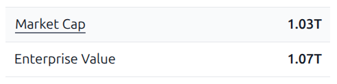
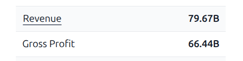
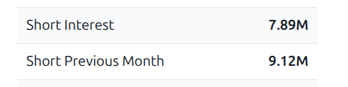
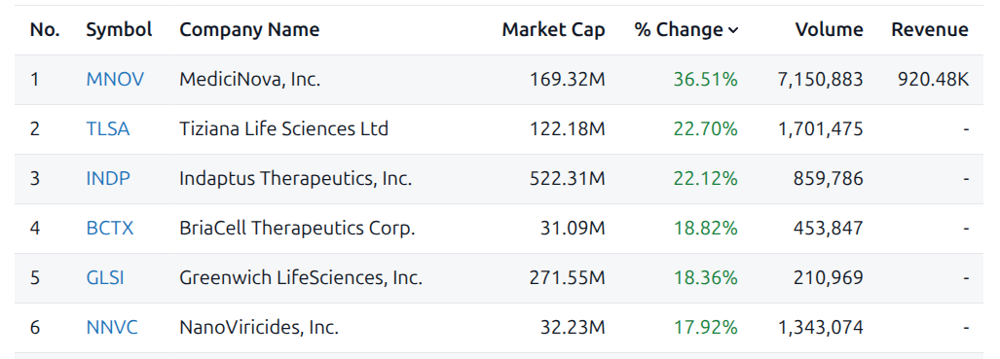
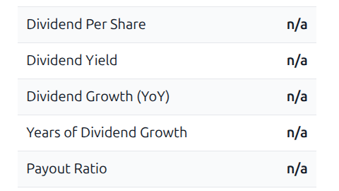

# pydev-challenge-cw
Prueba técnica para puesto Python Developer Jr. 

---

## Instrucciones de ejecución

### Opción A: Usando Docker
Construye la imagen, ejecuta los tests y corre el pipeline automaticamente:
```bash
docker compose up --build
```

### Opción B: Ambiente Virtual
### 1. Instalación de dependencias
```bash
python3 -m venv .venv
source .venv/bin/activate 
pip install -r requirements.txt
```

### 2. Ejecución de pruebas unitarias
```python -m pytest -v```

### 3. Ejecución del pipeline 
```python main.py```

---

## Criterio de Selección de Compañías
* **Fuente**: Sector Drug Manufacturers - General en Stock Analysis 
    `https://stockanalysis.com/stocks/industry/drug-manufacturers-general/`
* **Fecha de consulta:** 18 de septiembre de 2026
* **Criterio aplicado:** Selección de los 10 laboratorios farmacéuticos cotizados con mayor capitalización bursátil (`Market Cap`) listados directamente con ticker de EE. UU. (NYSE):
    * `LLY`, `JNJ`, `ABBV`, `MRK`, `NVS`, `AZN`, `AMGN`, `NVO`, `GILD`, `PFE`

---

## Brechas de Cobertura
* **Filtro de mercado**: Se consideraron unicamente compañias listadas en la bolsa de Nueva York. Laboratorios internacionales no se incluyeron en esta iteración para mantener un formato de URL y moneda homogéneo dentro de Stock Analysis.

---

## Decisiones de Diseño y Asunciones Técnicas
* **Control de Concurrencia:** Se implementó `asyncio.Semaphore(2)` a nivel de scraper para garantizar que no existan más de 2 peticiones HTTP activas de manera simultánea.
* **Aislamiento de Errores por Ticker:** Cada petición se resuelve dentro de un bloque try/except, de modo que el fallo o timeout en un laboratorio no interrumpa la ejecución de las faltantes.

---

# Iteración 1: Scraper Base
Implementación inicial del pipeline asíncrono para extraccion de metricas de laboratorios farmaceuticos desde Stock Analysis.
Se establece el cliente HTTP asincrono, el control de concurrencia y deteccion del árbol DOM de las estadísticas.

---

# Iteración 2: Funciones auxiliares de parseo 
Normalización de Magnitudes y Tratamiento de Valores Ausentes
* Escala de Magnitudes Financieras:
    Stock Analysis compacta cifras en tablas usando:
    * `M`: factor de 10**6
    * `B`: factor de 10**9
    * `T`: factor de 10**12

    Todas las cifras con simbolos monetarios (`$`) y abreviación de escala se normalizan a un `float` en su unidad base monetaria (USD).
    <div align="center">
        
        
        
    </div>

* Diferenciación de Nulos vs. Ceros:
    La pagina presenta valores faltantes bajo dos representaciones principales detectadas en las tablas: guión simple (`"-"`) y el string `"n/a"`.
    * Dato no existente: Las cadenas `"-"`, `"n/a"` y vacios se normalizan a `None` en Python y se persistiran como NULL en SQL.
    <div align="center">
        
        
    </div>
    
    * Valor cero: Un valor explicito en cero se preserva numericamente como `0.0`. 

---

# Iteración 3: Extracción y Pruebas Unitarias
Definición del módulo de parseo (`src/parser.py`) y verificación de la lógica

* **Desacople de laboratorio y ticker:** Uso de (`rsplit`) sobre el encabezado principal para aislar el nombre respecto del ticker entre parentesis.
* **Detección de divisas:** La extracción de la divisa (`currency`) revisa el subencabezado de cotización en tiempo real.
* **Navegación celda a celda en tablas:** Se implementa una lectura fila a fila (`<tr>` y `<td>`) bajo el texto de indice (`Market Cap`, `52-Week Price Change`) para resolver problemas asociados a etiquetas anidadas.

### Cobertura de Tests Unitarios
* `test_numeric_and_null_normalization`: Valida la conversión de magnitudes numericas, y asegura la diferenciación del cero numerico de la ausencia de valores. 
* `test_extract_stock_data_sample_html`: Evalua la extracción integrada frente a un fixture HTML estático, asegurando el parseo esperado de los campos requeridos.
* `test_database_insert`: Comprueba la persistencia del `INSERT` ejecutando el motor de SQLite en memoria.

---

# Iteración 4: Modelado y Persistencia
* **Validacion del esquema:** Modelo `PharmaMetricSchema` para garantizar tipos de datos y valores opcionales antes de interactuar con la base de datos.
* **Persistencia:** Uso de `sqlite_insert` (`ON CONFLICT(ticker) DO UPDATE SET`) bajo la primary key `ticker`. Asegurando que varias ejecuciones del pipeline actualicen los registros existentes.
* **Visualización de salida:** Implementación de `print_all_metrics()` para comprobar los resultados directamente por terminal una vez concluido el pipeline.

---

# Iteración 5: Contenedorización con Docker
Creación de container para la solución para garantizar reproducibilidad y portabilidad.
* **Pipeline integrado:** Ejecucion de la suite de tests unitarios antes de lanzar el pipeline de ingesta.
* **Persistencia desacoplada:** Montaje de volúmenes para auditar el archivo `pharma_pipeline.db`.

## Uso de Inteligencia Artificial 
* **Herramienta:** Gemini como Asistente de IA
* **Alcance:** Asistencia en el diseño estructural del repositorio | Revisión del borrador del README | Diseño de fixtures de prueba 